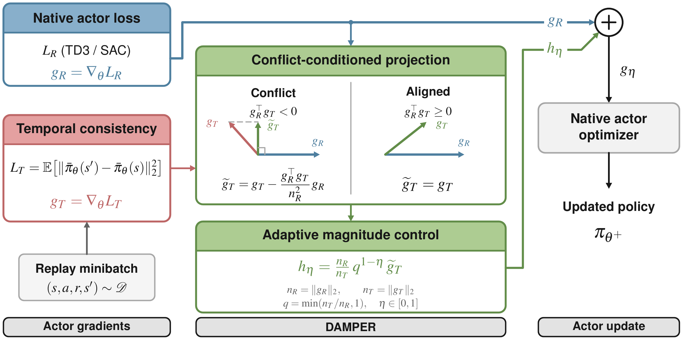

# DAMPER: Return-Prioritized Gradient Control for Smooth Policies

Implementation of **DAMPER (Direction-Aware Magnitude-Controlled Projection with Explicit Return Priority)** for TD3 and SAC.

DAMPER reduces action oscillation by combining the native actor gradient with a temporal-consistency gradient. It removes conflicting auxiliary components and adjusts their magnitude through a single interpolation parameter, $\eta \in [0,1]$. The method operates during training; policy execution requires no additional filtering or network components.

[Overview PDF](figures/damper_overview_v4.pdf) · [Method](#method) · [Results](#results) · [Quick start](#quick-start) · [Reproduction](#reproducing-the-experiments)

[](figures/damper_overview.pdf)

*The native actor gradient supplies the primary direction. DAMPER projects the temporal gradient only under conflict, controls its magnitude relative to the native gradient, and passes the merged gradient to the actor optimizer. Click the figure for the vector PDF.*

## Highlights

- **Return-prioritized gradient combination:** retain the native actor direction and remove only the opposing component of the temporal gradient.
- **One interpolation parameter:** move between cap-only and norm-matched temporal contributions with $\eta$.
- **Two backbones, six tasks:** evaluate TD3 and SAC on LunarLander, Pendulum, Reacher, Ant, Hopper, and Walker2d.
- **Consistent oscillation reduction:** lower FFT-based oscillation scores than the native agents in all **12 task–backbone pairs**, with the best score among the compared methods in **8 of 12**. Return trade-offs depend on the task.

## Method

### 1. Compute the two actor gradients

Let $L_R$ denote the native actor loss: the critic-based objective for TD3, or the entropy-regularized actor objective for SAC. Temporal consistency uses deterministic actions from the same current policy at consecutive states:

$$
L_T(\theta)=\mathbb{E}_{(s,s')\sim\mathcal{D}}\left[\left\|\bar{\pi}_\theta(s')-\bar{\pi}_\theta(s)\right\|_2^2\right],
\qquad
g_R=\nabla_\theta L_R,\quad g_T=\nabla_\theta L_T.
$$

For SAC, $\bar{\pi}_\theta$ is the deterministic squashed mean action. The contribution is the gradient-combination rule; the consecutive-state temporal penalty is an established smoothness objective.

### 2. Project only when the gradients conflict

$$
\widetilde{g}_T=
\begin{cases}
g_T-\dfrac{g_R^\top g_T}{\|g_R\|_2^2}g_R,& g_R^\top g_T<0,\\
g_T,& g_R^\top g_T\geq 0.
\end{cases}
$$

Aligned temporal information is retained. Only the auxiliary gradient is projected.

### 3. Control the temporal contribution

Using the norms **before projection**, define

$$
n_R=\|g_R\|_2,\qquad n_T=\|g_T\|_2,\qquad
q=\min\left(\frac{n_T}{n_R},1\right),\qquad w_\eta=q^{1-\eta}.
$$

For nonzero gradients, the paper's merged direction is

$$
g_\eta=g_R+h_\eta,\qquad
h_\eta=\frac{n_R}{n_T}w_\eta\widetilde{g}_T.
$$

| Setting | Effect on the temporal contribution |
| --- | --- |
| $\eta=0$ | Cap its magnitude at the native gradient norm, without amplifying weak temporal gradients. |
| $0<\eta<1$ | Interpolate between capping and norm matching; larger values strengthen weak temporal gradients. |
| $\eta=1$ | Match the native gradient norm before accounting for projection. |

The denominator remains the original $n_T$, so projection can reduce the final temporal contribution. The projected vector is not renormalized back to unit length.

### What return priority means

The analytic direction satisfies

$$
g_R^\top g_\eta\geq\|g_R\|_2^2,\qquad
\|h_\eta\|_2\leq\|g_R\|_2.
$$

Thus, it preserves the first-order decrease of the **fixed native actor surrogate**. Under the paper's smoothness assumptions, a sufficiently small Euclidean gradient step also decreases that surrogate. This is not a guarantee of monotonically increasing episodic return or of descent after an arbitrary adaptive-optimizer step.

<details>
<summary><strong>Implementation details</strong></summary>

The interpolated implementation is provided by [`DAMPERUnifiedTD3`](td3/models/damper_unified_td3.py) and [`DAMPERUnifiedSAC`](sac/models/damper_unified_sac.py).

- Gradient norms are numerically clamped. If one objective has an absent or zero gradient, the implementation falls back to the other objective's raw gradient.
- Temporal consistency uses deterministic current-policy actions and filters transitions marked as terminal in the sampled replay data.
- Critic parameters are frozen during actor-gradient computation. TD3's critic update and delayed actor schedule, and SAC's critic and entropy-coefficient updates, follow their native algorithms.
- The experiment networks use SiLU activations. No extra network is introduced by DAMPER.

</details>

## Results

The following values are from **Tables 1 and 2 of the DAMPER manuscript**. Entries are **mean ± standard deviation across five training seeds**, with **10 evaluation episodes per seed**. Higher episodic return is better; lower FFT-based oscillation score (`sm`) is better.

The full comparison includes the native agents, CAPS, Grad-CAPS, ASAP, L2C2, and PAVE. The tables below show the native agents and DAMPER; **bold oscillation scores** are the lowest among all methods in the corresponding manuscript table.

### TD3

| Task | TD3 return ↑ | DAMPER return ↑ | TD3 `sm` ↓ | DAMPER `sm` ↓ |
| --- | ---: | ---: | ---: | ---: |
| LunarLander | 205.5 ± 98.5 | 266.4 ± 35.8 | 1.815 ± 0.955 | **0.313 ± 0.036** |
| Pendulum | -157.6 ± 84.0 | -154.6 ± 78.7 | 2.308 ± 1.422 | 0.463 ± 0.131 |
| Reacher | -3.34 ± 1.45 | -3.63 ± 1.44 | 0.050 ± 0.015 | 0.048 ± 0.016 |
| Ant | 4749 ± 1226 | 5281 ± 887 | 2.044 ± 0.307 | **1.261 ± 0.147** |
| Hopper | 3604 ± 150 | 3078 ± 599 | 3.061 ± 0.421 | **0.240 ± 0.035** |
| Walker2d | 4596 ± 328 | 4275 ± 322 | 1.937 ± 0.139 | **0.346 ± 0.088** |

### SAC

| Task | SAC return ↑ | DAMPER return ↑ | SAC `sm` ↓ | DAMPER `sm` ↓ |
| --- | ---: | ---: | ---: | ---: |
| LunarLander | 162.6 ± 139.9 | 281.5 ± 24.4 | 0.402 ± 0.143 | **0.102 ± 0.037** |
| Pendulum | -149.9 ± 76.9 | -156.6 ± 78.5 | 0.479 ± 0.128 | 0.336 ± 0.164 |
| Reacher | -3.49 ± 1.43 | -3.57 ± 1.57 | 0.053 ± 0.016 | **0.038 ± 0.018** |
| Ant | 5001 ± 1145 | 4564 ± 1577 | 1.935 ± 0.234 | **1.207 ± 0.253** |
| Hopper | 3059 ± 825 | 3384 ± 273 | 0.708 ± 0.074 | 0.571 ± 0.022 |
| Walker2d | 4771 ± 292 | 4402 ± 1086 | 0.747 ± 0.081 | **0.268 ± 0.044** |

Smoothness should be assessed together with return. For example, DAMPER reduces TD3 Hopper's oscillation score from 3.061 to 0.240, while mean return decreases from 3604 to 3078. On LunarLander, both backbones improve in both metrics.

The paper also studies unconditional sum/projection alternatives, a PEGrad-based baseline, interpolation sweeps, and fixed-weight temporal-loss scalarization.

## Quick start

### Installation

The DAMPER experiment specification uses Python 3.11, PyTorch 2.5.1, Stable-Baselines3 2.5.0, and Gymnasium 1.0.0. MuJoCo is used for locomotion and Reacher; Box2D is needed for LunarLander.

```bash
git clone https://github.com/komin0407/DAMPER.git
cd DAMPER

conda create -n damper python=3.11 -y
conda activate damper

python -m pip install torch==2.5.1
python -m pip install swig
python -m pip install "stable-baselines3==2.5.0" \
  "gymnasium[classic-control,mujoco,box2d]==1.0.0" \
  numpy scipy matplotlib pandas tqdm tensorboard
```

The trainers automatically select CUDA when available and otherwise use the CPU. For the CUDA 12.1 PyTorch build recorded in the experiment specification, install PyTorch with `python -m pip install torch==2.5.1 --index-url https://download.pytorch.org/whl/cu121`.

### Train DAMPER

Run each trainer **from its environment directory**, because validation seeds are read from `data/validation_seeds.txt` relative to the working directory.

From the repository root, train TD3 and SAC on Hopper with the paper's respective interpolation settings:

```bash
cd experiments/hopper

python train_damper_unified_td3_hopper.py \
  --eta 1.0 --train_seed 178132 \
  --max_minutes 420 --run_name td3_eta10_seed178132

python train_damper_unified_sac_hopper.py \
  --eta 0.0 --train_seed 178132 \
  --max_minutes 420 --run_name sac_eta00_seed178132
```

For a short installation check, run the following from the repository root:

```bash
cd experiments/pendulum
python train_damper_unified_td3_pendulum.py \
  --eta 1.0 --train_seed 178132 \
  --max_minutes 2 --run_name td3_smoke
```

`--max_minutes 2` selects 1,500 training steps and one evaluation episode. Full runs use the step budgets below. **`--max_minutes` is not a hard training timeout**: the scripts finish the configured `learn()` call before checking elapsed time.

### Evaluate the recorded rollouts

Each trainer evaluates the deterministic policy after training and writes `runs/<run_name>/results.json`, including per-episode returns and action sequences. The provided trainers do not save model checkpoints.

From `experiments/hopper`:

```bash
python score_hopper.py runs/td3_eta10_seed178132/results.json "DAMPER-TD3"
python score_hopper.py runs/sac_eta00_seed178132/results.json "DAMPER-SAC"
```

The score script reports return and FFT-based oscillation statistics **across evaluation episodes for one training seed**. To match the manuscript's aggregation, first compute each training seed's mean over its 10 episodes, then compute the mean and standard deviation across the five training seeds.

## Reproducing the experiments

### Task settings

These interpolation values and training budgets follow Tables 6 and 7 of the manuscript. Trainer names follow `train_damper_unified_{td3,sac}_<suffix>.py` inside each listed directory.

| Task | Directory | Trainer suffix | Training steps | TD3 $\eta$ | SAC $\eta$ |
| --- | --- | --- | ---: | ---: | ---: |
| LunarLander | `experiments/lunarlander` | `lunar` | 500,000 | 0.8 | 1.0 |
| Pendulum | `experiments/pendulum` | `pendulum` | 100,000 | 1.0 | 1.0 |
| Reacher | `experiments/reacher` | `reacher` | 500,000 | 1.0 | 0.8 |
| Ant | `experiments/ant` | `ant` | 1,000,000 | 0.0 | 0.0 |
| Hopper | `experiments/hopper` | `hopper` | 1,000,000 | 1.0 | 0.0 |
| Walker2d | `experiments/walker` | `walker` | 1,000,000 | 1.0 | 1.0 |

The trainers use a batch size of `256`, replay capacity `1,000,000`, discount `0.99`, and target-update coefficient `0.005`. Hidden-layer widths are `(400, 300)` for TD3 and `(256, 256)` for SAC, with SiLU activations. TD3 uses Gaussian exploration noise with standard deviation `0.1` per action dimension; evaluation is deterministic.

The recorded training seeds are `178132`, `410580`, `922852`, `787576`, and `660993`. For example, run five TD3 Hopper seeds from `experiments/hopper`:

```bash
for seed in 178132 410580 922852 787576 660993; do
  python train_damper_unified_td3_hopper.py \
    --eta 1.0 --train_seed "$seed" \
    --max_minutes 420 --run_name "td3_eta10_seed${seed}"
done
```

Each environment directory contains the fixed validation seeds used for its 10 evaluation episodes. Additional implementation, environment, and evaluation details are in [`EXPERIMENTS.md`](EXPERIMENTS.md).

### Repository guide

| Path | Contents |
| --- | --- |
| [`td3/models/damper_unified_td3.py`](td3/models/damper_unified_td3.py) | Interpolated DAMPER actor update for TD3. |
| [`sac/models/damper_unified_sac.py`](sac/models/damper_unified_sac.py) | Interpolated DAMPER actor update for SAC. |
| [`experiments/`](experiments/) | Per-task DAMPER trainers, validation seeds, and rollout-scoring scripts. |
| [`td3/models/`](td3/models/) and [`sac/models/`](sac/models/) | Native agents, smoothness baselines, and DAMPER variants. |
| [`td3/tests/`](td3/tests/) and [`sac/tests/`](sac/tests/) | Baseline training, evaluation, and shared utilities. |
| [`figures/`](figures/) | DAMPER overview in PNG and vector PDF formats. |
| [`EXPERIMENTS.md`](EXPERIMENTS.md) | Detailed implementation settings and experiment protocol. |

Use the `damper_unified_*` implementations for the paper's interpolation parameter. The repository also retains the original norm-balanced (`damper_*`), cap-only (`damper_cap_*`), and exploratory alignment-adaptive SAC (`damper_ada_sac`) variants.

## Acknowledgements

The implementation and experimental protocol build on the [PAVE codebase](https://airlabkhu.github.io/PAVE/), which in turn builds on [ASAP](https://github.com/AIRLABkhu/ASAP). We thank the authors for releasing the TD3/SAC infrastructure, baseline implementations, and evaluation utilities used by this project.

## License

This repository is distributed under the [MIT License](LICENSE). Please retain the upstream copyright and license notices when reusing the code.
